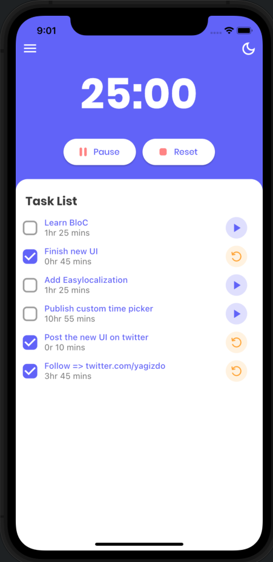

# Timefaze

Pomodoro App I made with Flutter.


### App Store
Soon..
<!-- <a href="https://apps.apple.com/us/app/todo-moon/id1614639836?itsct=apps_box_badge&amp;itscg=30200" style="display: inline-block; overflow: hidden; border-radius: 13px; width: 250px; height: 83px;"></a> -->
### Google Play
Soon..
<!-- <a href='https://play.google.com/store/apps/details?id=com.yagizdokumaci.todo_app&pcampaignid=pcampaignidMKT-Other-global-all-co-prtnr-py-PartBadge-Mar2515-1'>
   </a>
-->

## Run Locally

Clone the project

```bash
  git clone https://github.com/yagizdo/Timefaze
```

Go to the project directory

```bash
  cd Timefaze
```

Install dependencies

```bash
  flutter pub get
```

Run App

```bash
  flutter run
```


## What will be add :question:

- [x] Dark Mode
- [x] Drawer Menu
- [X] Localization
- [ ] Pomodoro System
- [ ] Shared Preferences for Localization
- [ ] State Management (Bloc)
- [ ] Splash Screen


##  Libraries I use in the application:
- Provider : https://pub.dev/packages/provider
- Shared Preferences : https://pub.dev/packages/shared_preferences
- Hex Color : https://pub.dev/packages/hexcolor
- Flutter Screen Util : https://pub.dev/packages/flutter_screenutil
- Google Fonts : https://pub.dev/packages/google_fonts
- Easy Localization : https://pub.dev/packages/easy_localization
- Flutter Svg : https://pub.dev/packages/flutter_svg
- Flutter Picker : https://pub.dev/packages/flutter_picker
- Flutter Slider Drawer : https://pub.dev/packages/flutter_slider_drawer


## App Video
Soon..


## Screenshots

### Home Screen - Light Mode


### Settings - Dark Mode


## Contributing

Contributions are always welcome!
